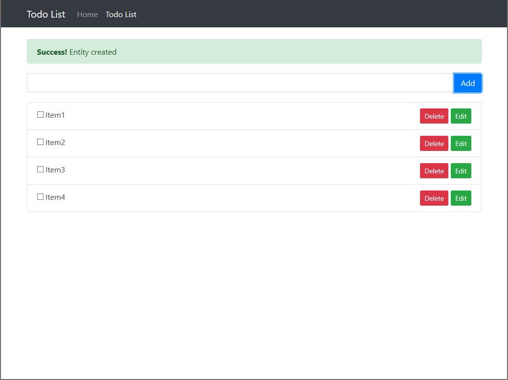

# AKeToan entry project

requirement:

1. implement api POST/GET/PUT/DELETE to CRUD doto, using mongodb, mongoosejs as mongo driver [*]
2. implement web app using ant design and reactjs [*]
3. implement redux action, reducer to state management [*]
4. implement jest to test api. using supertest and mongodb-memory-server to test api
5. implement snapshot test
6. setup Dockerfile to build image